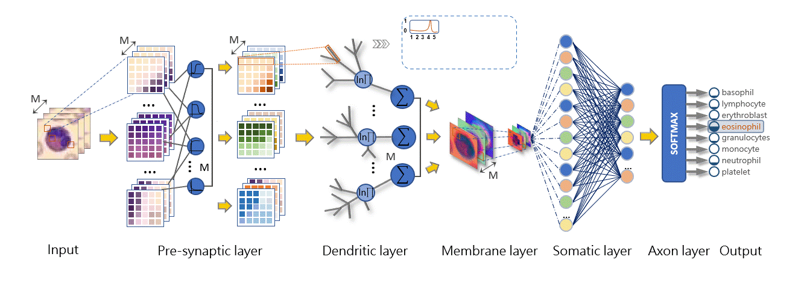

# MDPN
## Tittle
A Lightweight Multi-Dendritic Pyramidal Neuron Model with Neural Plasticity on Image Recognition
## Authors
Yu Zhang, Pengxing Cai, Yanan Sun, Zhiming Zhang, Zhenyu Lei, and Shangce Gao
## Abstract
MDPN is a lightweight neural network architecture that simulates the dendritic structure of pyramidal neurons to improve image representation, emphasizing nonlinear dendritic computation and neuroplasticity. In comparison with the traditional feedforward network model, MDPN focused on the importance of single neuron and redefined the function of each subcomponent. Experimental results verify the effectiveness and robustness of our proposed MDPN on 16 standardized image datasets.
## Architecture

## Running case
```
python main.py --model 0 --data_num 0 --lr 0.001 --epochs 50 --batch_size 64 --device 'cuda:0'
```
## Related Projects
Our code is based on [PyTorch](https://github.com/pytorch/pytorch)

## Citation
```
@article{zhang2024dendritic,
  author={Zhang, Yu and Cai, Pengxing and Sun, Yanan and Zhang, Zhiming and Lei, Zhenyu and Gao, Shangce},
  journal={IEEE Transactions on Artificial Intelligence}, 
  title={A Lightweight Multi-Dendritic Pyramidal Neuron Model with Neural Plasticity on Image Recognition}, 
  year={2024},
  volume={5},
  number={9},
  pages={4415-4427},
  doi={10.1109/TAI.2024.3379968}
}
```
